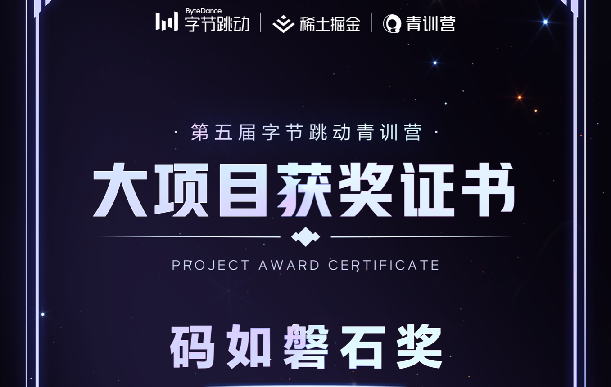

# Toktik

|  | 集成 ChatGPT 的短视频微服务应用，使用 Kitex 和 Hertz 构建，由 [Toktik-Team](https://github.com/Toktik-Team) 开发，作为*第五届字节跳动青训营*大作业。 |
| -------------------------------------------------------------------- | --------------------------------------------------------------------------------------------------------------------------------- |

[English](README.md) | **简体中文**

*第五届字节跳动青训营*大作业汇报文档: <https://qrggpk56b9.feishu.cn/docx/Djwpdm8oZo3JyRx0JwkcZhRDnVd>

## Recommend
现在推荐使用 [GuGoTik](https://github.com/GuGoOrg/GuGoTik)!  

TokTik 目前不再维护且尚未有维护计划，推荐查看 [GuGoTik](https://github.com/GuGoOrg/GuGoTik)。GuGoTik 秉承 TokTik 的核心思想并扬长避短，匠心改进了几乎所有的模块并加入了更丰富的功能。为了让您得到更好的实验体验，请移玉步到 [GuGoTik](https://github.com/GuGoOrg/GuGoTik)。

如果你喜欢我们的项目的话，请给我们 Stars ~

## Awards

获得 *第五届字节跳动青训营* **_码如磐石奖（一等奖）_** 奖项.

## 示例

> 从 [此处](https://bytedance.feishu.cn/docs/doccnM9KkBAdyDhg8qaeGlIz7S7#) 下载抖声 app 后, 填入以下地址来体验 demo。

https://toktik.xctra.cn/

## 项目结构

- [constant](constant)
  - [biz](constant/biz) - 业务逻辑相关常量
  - [config](constant/config)
    - [env.go](constant/config/env.go) - 环境变量配置
    - [service.go](constant/config/service.go) - 服务名称和端口
- [idl](idl)
  - [auth.proto](idl/auth.proto) - 认证服务 RPC 定义
  - [comment.proto](idl/comment.proto) - 评论服务 RPC 定义
  - [favorite.proto](idl/favorite.proto) - 点赞服务 RPC 定义
  - [feed.proto](idl/feed.proto) - 视频流服务 RPC 定义
  - [publish.proto](idl/publish.proto) - 视频发布服务 RPC 定义
  - [relation.proto](idl/relation.proto) - 关注服务 RPC 定义
  - [user.proto](idl/user.proto) - 用户服务 RPC 定义
  - [wechat.proto](idl/wechat.proto) - 聊天服务 RPC 定义
- [kitex_gen](kitex_gen) - 由 Kitex 自动生成的代码
- [logging](logging) - 日志中间件配置
- [manifests-dev](manifests-dev) - Kubernetes 清单文件
- [repo](repo) - 数据库概要和由 Gorm Gen 自动生成的代码
- [service](service)
  - [auth](service/auth) - 鉴权服务实现
  - [comment](service/comment) - 评论服务实现
  - [favorite](service/favorite) - 点赞服务实现
  - [feed](service/feed) - 视频流服务实现
  - [publish](service/publish) - 视频发布服务实现
  - [relation](service/relation) - 关注服务实现
  - [user](service/user) - 用户服务实现
  - [web](service/web) - Web API 网关
    - [mw](service/web/mw) - Hertz 中间件
  - [wechat](service/wechat) - 聊天服务实现
- [storage](storage) - 对象存储中间件，支持 Amazon S3 和本地存储和火山引擎 [ImageX](https://www.volcengine.com/products/imagex)
- [test](test)
  - [e2e](test/e2e) - 端到端测试
  - [mock](test/mock) - 用于单元测试的 mock 数据

## 准备环境

> 本项目不支持 Windows 操作系统，见 [Kitex](https://www.cloudwego.io/zh/docs/kitex/getting-started/#%E5%87%86%E5%A4%87-golang-%E5%BC%80%E5%8F%91%E7%8E%AF%E5%A2%83)

- Linux / MacOS
- Go
- FFmpeg
- PostgreSQL
- Redis
- OpenTelemetry Collector

推荐使用以下可观测性基础设施:

- Jaeger All in one
- Victoria Metrics
- Grafana

## 构建

执行 `./build-all.sh` 一次性构建所有服务.

## 配置

见 [`constant/config/env.go`](constant/config/env.go)

## 运行

- 执行 `start.sh --service <service_name>` 启动任一服务.
- `service_name` 可以是 `./service` 目录下任一子目录名称.

## 测试

### 单元测试

运行 `./unit-test.sh`

### 端到端测试

执行 `go test toktik/test/e2e -tags="e2e"`

## 如何贡献

1. 请遵循 [HowToAddServices](docs/HowToAddServices.md) 文件说明以创建新的服务。
2. 创建一个新的分支并做出更改。
3. 提交一个 Pull Request 到 `main` 分支。
4. 等待 review 和合并。

## 贡献者

- [Nico](https://github.com/nicognaW)
- [Eric_Lian](https://github.com/ExerciseBook)
- [Dark Litss](https://github.com/lss233)
- [HikariLan](https://github.com/shaokeyibb)
- [YunShu](https://github.com/Selflocking)

## 协议

Toktik is licensed under the [MIT License](LICENSE).
